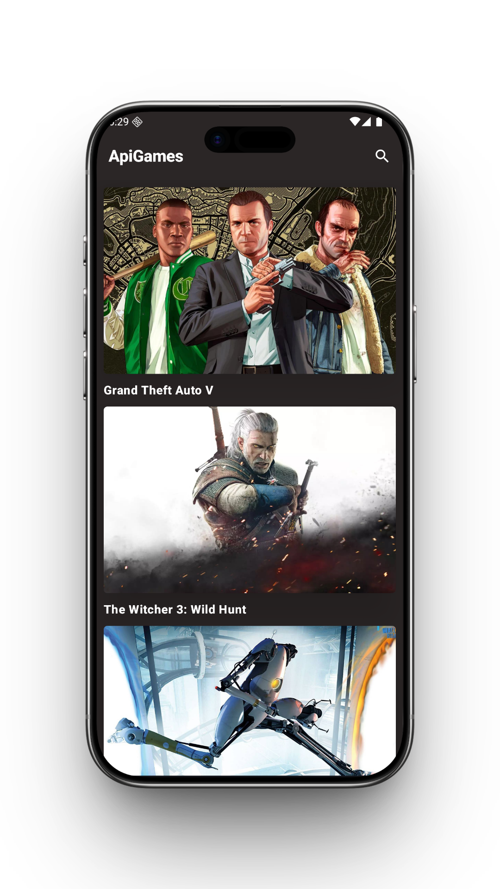
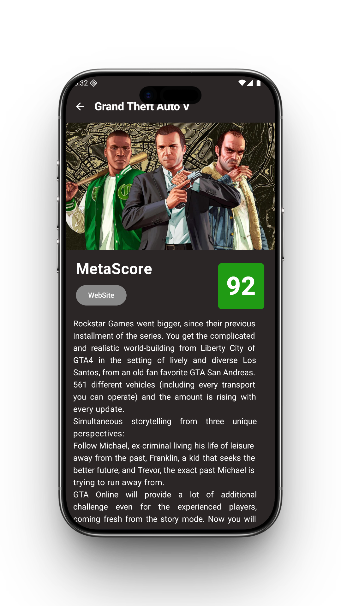
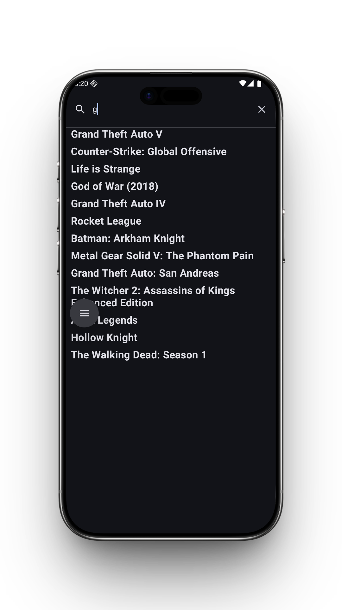
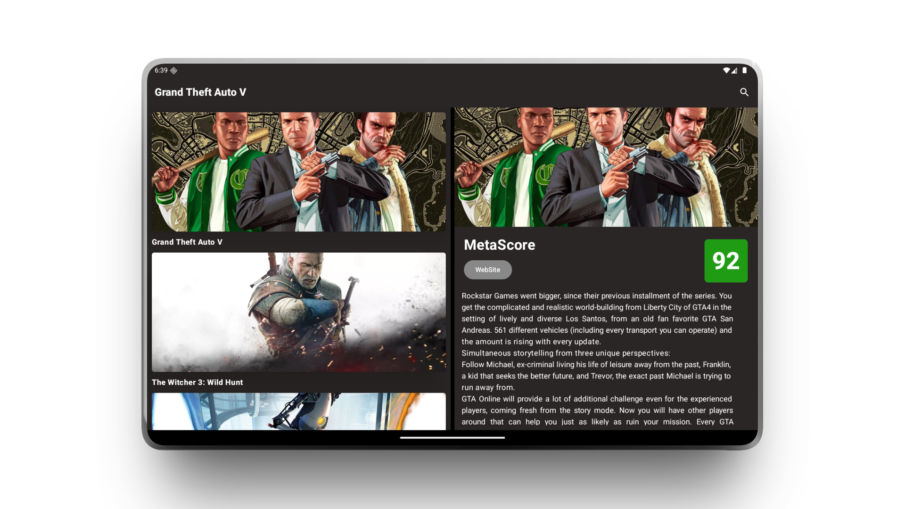

# ApiGames - Android App


**ApiGames** es una solución móvil nativa diseñada para la exploración de videojuegos. La aplicación no solo consume datos en tiempo real de la RAWG API, sino que implementa estándares modernos de ingeniería de software para garantizar una experiencia de usuario fluida y adaptable.

## ✨ Características Principales
* **Exploración Dinámica:** Listado exhaustivo de videojuegos con consumo de API en tiempo real.
* **Búsqueda Reactiva:** Implementación de `SearchBar` de Material3 con filtrado en tiempo real.
* **Diseño Responsivo (Adaptive UI):** Layout inteligente que alterna entre navegación estándar (Móvil) y panel dual **Master-Detail** (Tablets/Plegables).
* **Gestión de Estados:** Manejo robusto de estados de carga, error y éxito mediante programación reactiva.

## 📱 Implementación de Adaptive UI

El sistema detecta dinámicamente el tamaño de la ventana mediante `WindowSizeClass`:

* **Compact/Medium:** La navegación fluye de una pantalla a otra (Navegación lineal).
* **Expanded:** Se activa el `HomeAndDetailView`, que utiliza una estructura de `Row` y `weights` para mostrar la lista y los detalles en paralelo, optimizando el espacio en dispositivos de pantalla grande.


## 📸 Capturas de Pantalla 

La interfaz de **ApiGames** está diseñada para ser intuitiva y fluida, aprovechando componentes de **Material 3** y animaciones de **Compose**.

### 📱 Experiencia en Mobile
Manejo de estados y navegación lineal optimizada para una sola mano.

| Home View | Detail View | Search View |
| :---: | :---: | :---: |
|  |  |  |

---

### 🚀 Experiencia en Pantalla Grande (Tablet & Foldable)
Aquí es donde entra el **Adaptive UI**, mostrando cómo el contenido se reorganiza para maximizar la superficie de pantalla.

<p align="center">
  
  <br>
  <i>Patrón <b>Master-Detail</b> en modo horizontal: Visualización simultánea de la lista y la descripción del juego.</i>
</p>

---

## 🛠️ Tech Stack & Librerías

* **Lenguaje:** Kotlin (Coroutines & Flow).
* **DI:** Hilt (Dependency Injection) con módulos específicos para App y Repositorios.
* **Navegación:** Navigation Compose **Type-Safe** (usando Kotlin Serialization).
* **UI:** Jetpack Compose, Material3, Coil (Imágenes), WindowSizeClass.
* **Arquitectura:** Clean Architecture + MVVM + UDF.


## 🏗️ Arquitectura y Estructura del Proyecto

El proyecto implementa una separación estricta de responsabilidades, se rige bajo los principios de **Clean Architecture** y **SOLID**, estructurado en tres capas independientes:

### 1. Capa de Data (Infraestructura)
* **Retrofit:** Gestión de peticiones de red y configuración de `BASE_URL`.
* **Mappers:** Uso de funciones de extensión (`toDomain()`) para transformar DTOs en entidades puras de negocio, protegiendo la app de cambios en la API.
* **Security:** API Key protegida mediante `BuildConfig` y `local.properties`.
* **Resource Wrapper:** Gestión centralizada de respuestas (Success, Error, Loading).

### 2. Capa de Domain (Lógica de Negocio)
* **Entities:** Modelos de datos puros en Kotlin (`Game`, `GameDetail`).
* **Repository Interface:** Definición de contratos para la inversión de dependencias.
* **Use Cases:** Implementación de casos de uso independientes (`GetGamesUseCase`, `GetGameByIdUseCase`) mediante el operador `invoke`.

### 3. Capa de UI (Presentación)
* **Jetpack Compose:** Interfaz 100% declarativa con animaciones de transición (`Crossfade`).
* **MVVM + UDF:** Flujo unidireccional de datos utilizando `MutableStateFlow` y `collectAsStateWithLifecycle`.
* **State Management:** Uso de `HomeState` para representar de forma atómica el estado de la pantalla.

## 📂 Estructura del Proyecto

El proyecto está organizado bajo una arquitectura de capas (Clean Architecture), asegurando que cada componente tenga una responsabilidad única y clara:

```text

app/src/main/java/com/example/apigames/
├── core.common/         # Clase Resource para gestión de estados (Success, Error, Loading).
├── di/                  # Módulos de Inyección de Dependencias con Hilt.
├── domain/              # Capa de Dominio (Lógica de Negocio Pura):
│   ├── model/           # Entidades de datos.
│   ├── repository/      # Interfaces (Contratos) de repositorios.
│   └── use_case/        # Casos de uso de la aplicación.
├── data/                # Capa de Datos (Implementación):
│   ├── mapper/          # Mappers para transformar DTOs a modelos de dominio.
│   ├── remote/          # Cliente API y constantes de red.
│   └── repository/      # Implementación real de los repositorios.
└── ui/                  # Capa de Presentación (Jetpack Compose):
    ├── components/      # Componentes visuales reutilizables.
    ├── constans/        # Constantes específicas de la interfaz.
    ├── main/            # Lógica principal de la vista.
    ├── navigation/      # Configuración de rutas y navegación.
    ├── screens.homeScreen/ # Pantallas principales y sus ViewModels.
    ├── theme/           # Configuración de Material 3 (Color, Type, Shape).
    ├── MainActivity.kt  # Punto de entrada de la UI.
    ApiGameApplication.kt # Clase de aplicación para inicializar Hilt. 

```

## ⚙️ Instalación y Configuración

Para ejecutar este proyecto localmente y configurar tu propia llave de API, sigue estos pasos:

1. **Clonar el repositorio:**
   ```bash
   git clone https://github.com/VladimirOJDev/ApiGames.git
   ```
2. **Configurar la API Key (RAWG API):**
    Este proyecto utiliza BuildConfig para mantener las llaves seguras. Abre el archivo local.properties en la raíz de tu proyecto y añade la siguiente línea:
   ```bash
    API_KEY=tu_api_key_aqui
    ```
3. Cambiar las variables de entorno (The MovieDB)
   Abre el archivo .env y añade tu llave:
    ```bash
    MOVIE_DB_KEY=tu_api_key_aqui
    ```
4. Instalar dependencias y limpiar caché de Gradle:
   ```bash
   ./gradlew clean
    ```
5. Generar código y construir el proyecto
   ```bash
    ./gradlew assembleDebug
    ```
6. Ejecutar la aplicación
   Asegúrate de tener un emulador abierto o un dispositivo conectado:
      ```bash
    ./gradlew installDebug
    ```
      
## 🔐 Configuración de API Key

El proyecto utiliza `BuildConfig` para gestionar las credenciales de forma segura y evitar que se filtren en el control de versiones.

1. **Obtener Credenciales:**
   Regístrate en [RAWG.io](https://rawg.io/apidocs) para obtener tu propia `API_KEY`.

2. **Configurar local.properties:**
   En la raíz del proyecto, abre (o crea) el archivo `local.properties` y añade la siguiente variable:
   ```properties
   API_KEY=tu_api_key_aqui
---
